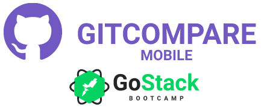

<h1 align="center">


GitCompare React Native

</h1>

<h4 align="center">
  Github repos compare with React Native
</h4>

<p align="center">
  

  

  

  <a href="https://api.codacy.com/project/badge/Grade/642876d3ff104c78a519e4117a6e1f14" target="_blank">
    
  </a>

  
</p>

<p align="center">
  
</p>

## :rocket: Technologies

This project was developed at the [RocketSeat GoStack Bootcamp](https://rocketseat.com.br/bootcamp) with the following technologies:

- [ReactJS](https://reactjs.org/)
- [React Native](https://facebook.github.io/react-native/)
- [Axios](https://github.com/axios/axios)
- [React Navigation](https://reactnavigation.org/)
- [styled-components](https://www.styled-components.com/)
- [react-native-vector-icons](https://github.com/oblador/react-native-vector-icons)
- [Reactotron](https://github.com/infinitered/reactotron)
- [VS Code](https://code.visualstudio.com/) with [EditorConfig](https://marketplace.visualstudio.com/items?itemName=EditorConfig.EditorConfig) and [ESLint](https://marketplace.visualstudio.com/items?itemName=dbaeumer.vscode-eslint)

## :information_source: How To Use

To clone and run this application, you'll need [Git](https://git-scm.com), [Node.js v10.16](https://nodejs.org/) or higher, [Yarn v1.13](https://yarnpkg.com/) or higher installed on your computer. From your command line:

```bash
# Clone this repository
$ git clone https://github.com/matheuskuster/gostack-gitcompare-mobile

# Go into the repository
$ cd gostack-gitcompare

# Install dependencies
$ yarn install

# Start Metro Server
$ react-native start

# Run in Android
$ react-native android

# Run in iOS
$ react-native ios
```

## :memo: License

This project is under the MIT license. See the [LICENSE](https://github.com/matheuskuster/gostack-gitcompare-mobile/blob/master/LICENSE) for more information.

---

Made with ♥ by Matheus Kuster :wave: [Get in touch!](https://www.linkedin.com/in/matheus-kuster/)
